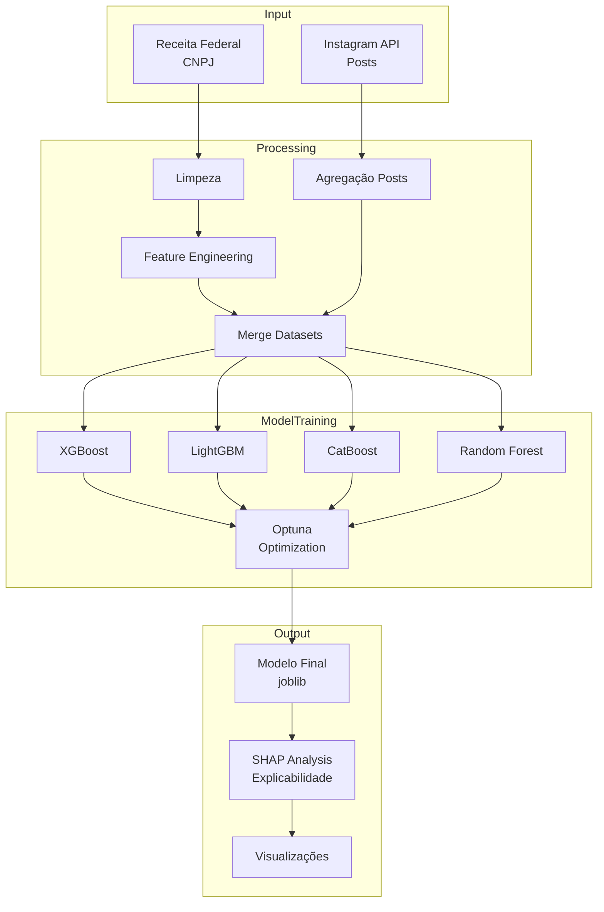

# Arquitetura do Sistema

## Componentes Principais

```mermaid
graph TB
    subgraph Input
        A[Receita Federal<br/>CNPJ]
        B[Instagram API<br/>Posts]
    end
    
    subgraph Processing
        C[Limpeza]
        D[Feature Engineering]
        E[Agregação Posts]
        F[Merge Datasets]
    end
    
    subgraph ModelTraining
        G[XGBoost]
        H[LightGBM]
        I[CatBoost]
        J[Random Forest]
        K[Optuna<br/>Optimization]
    end
    
    subgraph Output
        L[Modelo Final<br/>joblib]
        M[SHAP Analysis<br/>Explicabilidade]
        N[Visualizações]
    end
    
    A --> C
    B --> E
    C --> D
    D --> F
    E --> F
    F --> G
    F --> H
    F --> I
    F --> J
    G --> K
    H --> K
    I --> K
    J --> K
    K --> L
    L --> M
    M --> N
```

---

**Versão:** 1.0  
**Data:** Dezembro 2024

