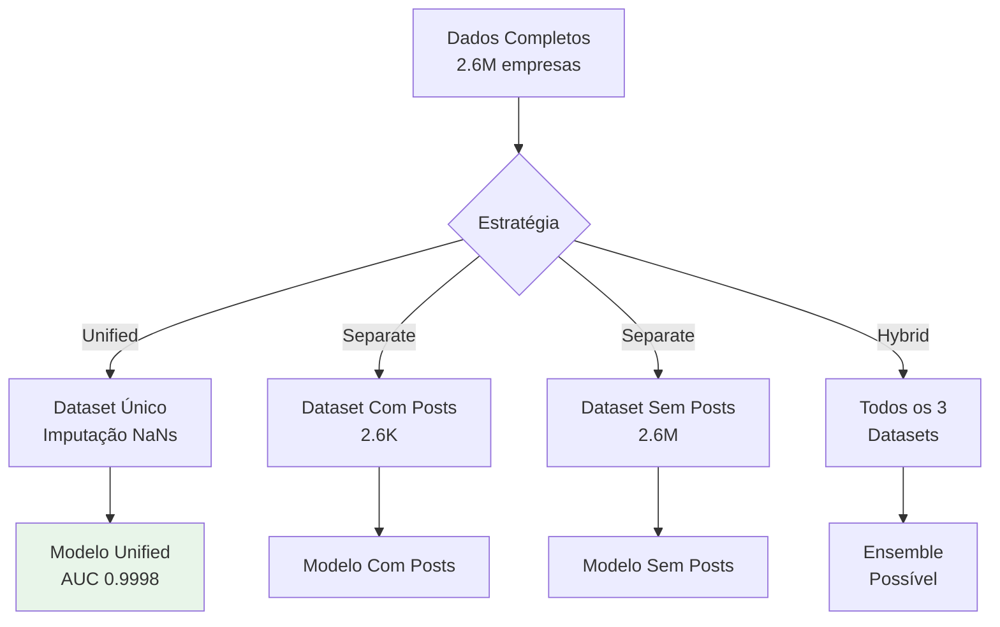
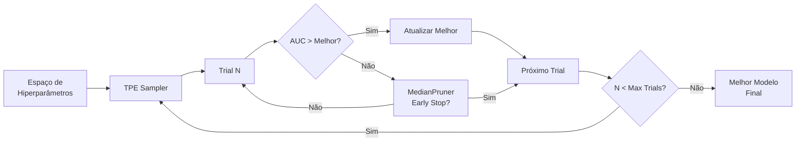

# Decisões de Modelagem

## Estratégias Implementadas

```mermaid
graph TB
    A[Dados Completos<br/>2.6M empresas] --> B{Estratégia}
    
    B -->|Unified| C[Dataset Único<br/>Imputação NaNs]
    B -->|Separate| D[Dataset Com Posts<br/>2.6K]
    B -->|Separate| E[Dataset Sem Posts<br/>2.6M]
    B -->|Hybrid| F[Todos os 3<br/>Datasets]
    
    C --> G[Modelo Unified<br/>AUC 0.9998]
    D --> H[Modelo Com Posts]
    E --> I[Modelo Sem Posts]
    F --> J[Ensemble<br/>Possível]
    
    style G fill:#e8f5e9
```

## Otimização Optuna

```mermaid
flowchart LR
    A[Espaço de<br/>Hiperparâmetros] --> B[TPE Sampler]
    B --> C[Trial N]
    C --> D{AUC > Melhor?}
    D -->|Sim| E[Atualizar Melhor]
    D -->|Não| F[MedianPruner<br/>Early Stop?]
    F -->|Sim| G[Próximo Trial]
    F -->|Não| C
    E --> G
    G --> H{N < Max Trials?}
    H -->|Sim| B
    H -->|Não| I[Melhor Modelo<br/>Final]
```

---

**Versão:** 1.0  
**Data:** Dezembro 2024

