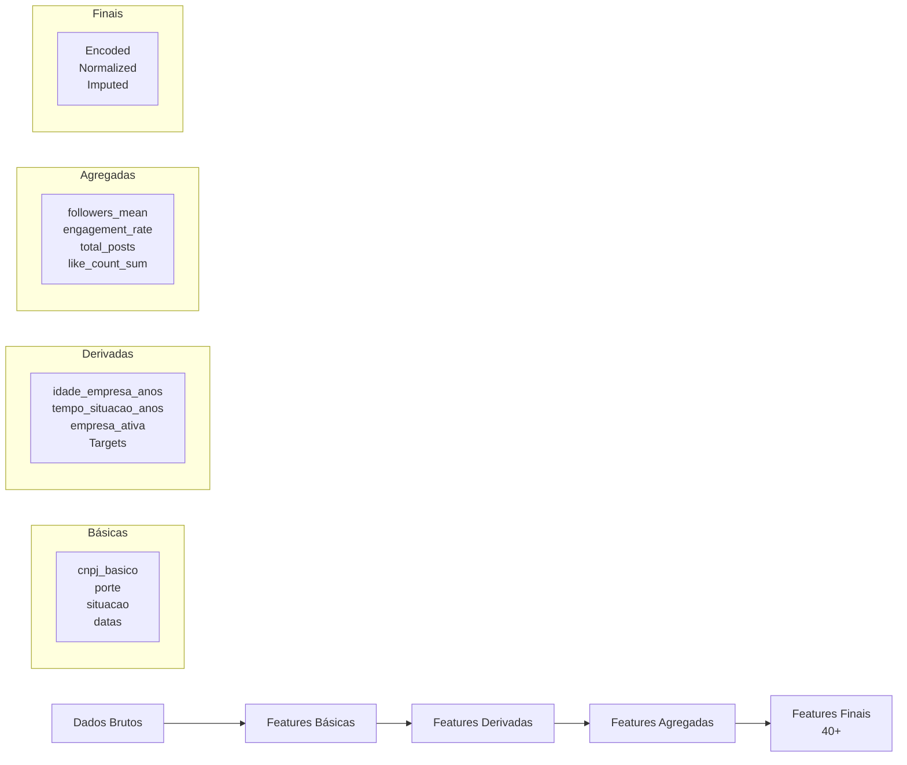
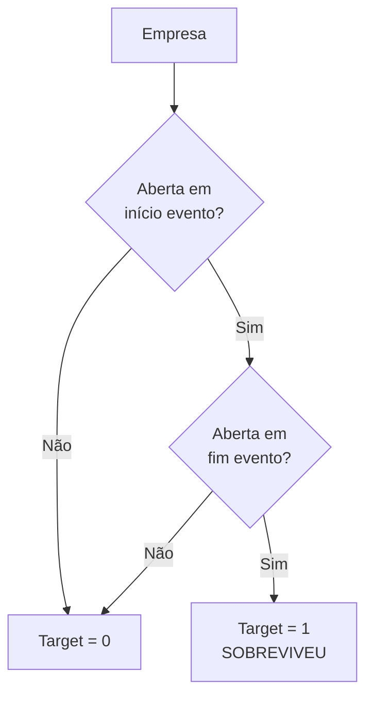

# Feature Engineering

## Criação de Features

```mermaid
graph LR
    A[Dados Brutos] --> B[Features Básicas]
    B --> C[Features Derivadas]
    C --> D[Features Agregadas]
    D --> E[Features Finais<br/>40+]
    
    subgraph Básicas
        F[cnpj_basico<br/>porte<br/>situacao<br/>datas]
    end
    
    subgraph Derivadas
        G[idade_empresa_anos<br/>tempo_situacao_anos<br/>empresa_ativa<br/>Targets]
    end
    
    subgraph Agregadas
        H[followers_mean<br/>engagement_rate<br/>total_posts<br/>like_count_sum]
    end
    
    subgraph Finais
        I[Encoded<br/>Normalized<br/>Imputed]
    end
```

## Targets de Sobrevivência

```mermaid
flowchart TD
    A[Empresa] --> B{Aberta em<br/>início evento?}
    B -->|Não| C[Target = 0]
    B -->|Sim| D{Aberta em<br/>fim evento?}
    D -->|Não| C
    D -->|Sim| E[Target = 1<br/>SOBREVIVEU]
```

---

**Versão:** 1.0  
**Data:** Dezembro 2024

