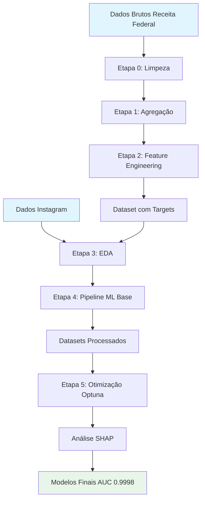
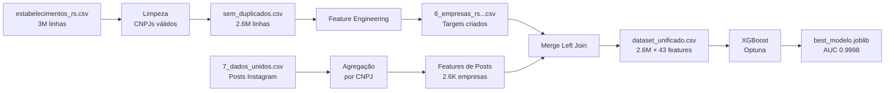

# Diagrama de Fluxo do Pipeline

## Pipeline Completo (End-to-End)

```mermaid
graph TB
    A[Dados Brutos Receita Federal] --> B[Etapa 0: Limpeza]
    B --> C[Etapa 1: Agregação]
    C --> D[Etapa 2: Feature Engineering]
    D --> E[Dataset com Targets]
    
    F[Dados Instagram] --> G[Etapa 3: EDA]
    E --> G
    
    G --> H[Etapa 4: Pipeline ML Base]
    H --> I[Datasets Processados]
    
    I --> J[Etapa 5: Otimização Optuna]
    J --> K[Análise SHAP]
    K --> L[Modelos Finais AUC 0.9998]
    
    style A fill:#e1f5ff
    style F fill:#e1f5ff
    style L fill:#e8f5e9
```

## Fluxo de Dados Detalhado

```mermaid
flowchart LR
    A[estabelecimentos_rs.csv<br/>3M linhas] --> B[Limpeza<br/>CNPJs válidos]
    B --> C[sem_duplicados.csv<br/>2.6M linhas]
    C --> D[Feature Engineering]
    D --> E[6_empresas_rs...csv<br/>Targets criados]
    
    F[7_dados_unidos.csv<br/>Posts Instagram] --> G[Agregação<br/>por CNPJ]
    G --> H[Features de Posts<br/>2.6K empresas]
    
    E --> I[Merge Left Join]
    H --> I
    I --> J[dataset_unificado.csv<br/>2.6M × 43 features]
    
    J --> K[XGBoost<br/>Optuna]
    K --> L[best_modelo.joblib<br/>AUC 0.9998]
```

---

**Versão:** 1.0  
**Data:** Dezembro 2024

