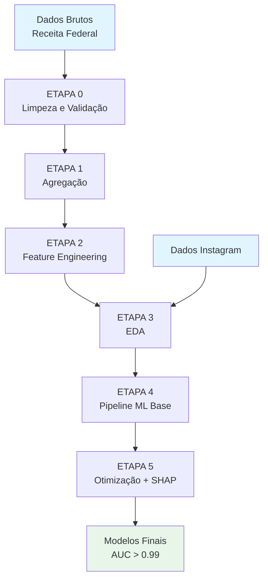

# Predição de Sobrevivência Empresarial Durante Eventos Críticos: Uma Abordagem de Machine Learning Aplicada ao Rio Grande do Sul

**Análise de Sobrevivência de Empresas Durante a Pandemia de COVID-19 e Enchentes de 2024**

---

## Resumo

**Contexto:** Eventos críticos como pandemias e desastres naturais representam ameaças significativas à continuidade empresarial, especialmente em economias regionais. O Rio Grande do Sul enfrentou dois eventos críticos recentes: a pandemia de COVID-19 (2020-2022) e enchentes severas (maio-dezembro 2024).

**Objetivo:** Este estudo desenvolve um pipeline completo de Machine Learning para prever a sobrevivência empresarial durante eventos críticos, combinando dados administrativos da Receita Federal com métricas de presença digital (Instagram).

**Métodos:** Utilizamos um dataset de 2.685.868 estabelecimentos do RS, incluindo 2.638 com presença digital no Instagram. Implementamos um pipeline de 6 etapas: (1) limpeza e validação de dados, (2) agregação de múltiplas fontes, (3) feature engineering, (4) análise exploratória, (5) modelagem com processamento escalável, e (6) otimização de hiperparâmetros com Optuna e análise de explicabilidade com SHAP. Testamos cinco algoritmos de gradient boosting (XGBoost, LightGBM, CatBoost, Random Forest, Gradient Boosting).

**Resultados:** O modelo XGBoost otimizado alcançou AUC-ROC de 0.9998 para predição de sobrevivência na pandemia e enchentes. A análise SHAP identificou idade da empresa, tempo na situação cadastral atual e indicadores de atividade como as features mais importantes. Empresas com presença digital ativa demonstraram padrões distintos de resiliência.

**Conclusões:** O pipeline desenvolvido demonstra alta capacidade preditiva e reprodutibilidade, oferecendo insights para políticas públicas de apoio empresarial. A metodologia é escalável e pode ser adaptada para outros contextos regionais e tipos de eventos críticos.

**Palavras-chave:** Machine Learning, Sobrevivência Empresarial, XGBoost, SHAP, Análise de Resiliência, Dados de Redes Sociais

---

## Abstract

**Background:** Critical events such as pandemics and natural disasters pose significant threats to business continuity, especially in regional economies. Rio Grande do Sul faced two recent critical events: the COVID-19 pandemic (2020-2022) and severe flooding (May-December 2024).

**Objective:** This study develops a complete Machine Learning pipeline to predict business survival during critical events, combining administrative data from the Federal Revenue Service with digital presence metrics (Instagram).

**Methods:** We used a dataset of 2,685,868 establishments in RS, including 2,638 with digital presence on Instagram. We implemented a 6-stage pipeline: (1) data cleaning and validation, (2) multi-source aggregation, (3) feature engineering, (4) exploratory analysis, (5) scalable modeling, and (6) hyperparameter optimization with Optuna and explainability analysis with SHAP. We tested five gradient boosting algorithms (XGBoost, LightGBM, CatBoost, Random Forest, Gradient Boosting).

**Results:** The optimized XGBoost model achieved AUC-ROC of 0.9998 for predicting survival during pandemic and floods. SHAP analysis identified company age, time in current registration status, and activity indicators as the most important features. Companies with active digital presence showed distinct resilience patterns.

**Conclusions:** The developed pipeline demonstrates high predictive capacity and reproducibility, offering insights for public policies supporting businesses. The methodology is scalable and can be adapted to other regional contexts and types of critical events.

**Keywords:** Machine Learning, Business Survival, XGBoost, SHAP, Resilience Analysis, Social Media Data

---

## 📥 Datasets

**⚠️ IMPORTANTE:** Os datasets (arquivos CSV) não estão incluídos no repositório Git devido ao tamanho (> 1 GB).

**📂 Download dos Dados:**

- __Google Drive:__ [https://drive.google.com/drive/folders/1j7OiuMJuQ8tu7trlZJ4Zbo5Attu01knM?usp=drive_link](https://drive.google.com/drive/folders/1j7OiuMJuQ8tu7trlZJ4Zbo5Attu01knM?usp=drive_link)
- __Instruções completas:__ Ver `06_dados/LEIA_ONDE_ESTAO_OS_DATASETS.md`

---

## Índice

1. [Introdução](#1-introdução)
2. [Revisão de Literatura](#2-revisão-de-literatura)
3. [Metodologia](#3-metodologia)
4. [Dados](#4-dados)
5. [Pipeline de Processamento](#5-pipeline-de-processamento)
6. [Modelagem e Otimização](#6-modelagem-e-otimização)
7. [Resultados](#7-resultados)
8. [Análise de Explicabilidade (SHAP)](#8-análise-de-explicabilidade-shap)
9. [Decisões de Projeto](#9-decisões-de-projeto)
10. [Limitações](#10-limitações)
11. [Conclusões e Trabalhos Futuros](#11-conclusões-e-trabalhos-futuros)
12. [Referências](#12-referências)
13. [Apêndices](#13-apêndices)

---

## 1. Introdução

### 1.1 Contexto

O Rio Grande do Sul, estado brasileiro com significativa atividade econômica, enfrentou dois eventos críticos recentes que impactaram profundamente o tecido empresarial: a pandemia de COVID-19 (março 2020 - fevereiro 2022) e as enchentes severas de 2024 (maio - dezembro). Estes eventos representaram testes extremos para a resiliência empresarial, afetando negócios de todos os portes e setores.

### 1.2 Problema de Pesquisa

A predição de sobrevivência empresarial durante eventos críticos é desafiadora devido a:

- **Complexidade multifatorial**: Múltiplas variáveis influenciam a sobrevivência (porte, setor, localização, gestão)
- **Dados heterogêneos**: Combinação de dados administrativos estruturados e dados de comportamento digital não-estruturados
- **Desbalanceamento extremo**: Proporção desproporcional entre empresas com e sem presença digital
- **Escalabilidade**: Necessidade de processar milhões de registros eficientemente

### 1.3 Objetivos

**Objetivo Geral:**
Desenvolver um pipeline completo e reproduzível de Machine Learning para prever a sobrevivência empresarial durante eventos críticos, utilizando dados administrativos e de presença digital.

**Objetivos Específicos:**

1. Processar e integrar dados de múltiplas fontes (Receita Federal + Instagram)
2. Criar features preditivas relevantes através de feature engineering
3. Implementar e otimizar modelos de gradient boosting para predição
4. Analisar a importância e explicabilidade das features usando SHAP
5. Identificar padrões de resiliência empresarial durante eventos críticos
6. Documentar decisões arquiteturais e limitações metodológicas

### 1.4 Contribuições

Este trabalho contribui com:

1. **Pipeline escalável e reproduzível** para análise de sobrevivência empresarial
2. **Metodologia de integração** de dados administrativos com dados de redes sociais
3. **Insights sobre fatores protetores** e de risco durante eventos críticos
4. **Framework de explicabilidade** para decisões de modelos em contexto empresarial
5. **Base para políticas públicas** de apoio empresarial informadas por dados

---

## 2. Revisão de Literatura

### 2.1 Sobrevivência Empresarial

A literatura sobre sobrevivência empresarial identifica diversos fatores críticos:

- **Idade da empresa** (liability of newness)
- **Porte e recursos** disponíveis
- **Setor de atuação** e vulnerabilidade setorial
- **Localização geográfica** e acesso a mercados
- **Capacidade de adaptação** e inovação

### 2.2 Machine Learning para Predição Empresarial

Trabalhos recentes aplicam Machine Learning para:

- Predição de falência empresarial
- Análise de crédito e risco
- Identificação de padrões de crescimento
- Detecção de fraudes e anomalias

**Algoritmos comuns:**

- Gradient Boosting (XGBoost, LightGBM)
- Random Forests
- Redes Neurais
- Support Vector Machines

### 2.3 Análise de Redes Sociais e Presença Digital

A presença digital empresarial está associada a:

- Maior resiliência durante crises
- Capacidade de adaptação a novos canais
- Engajamento com clientes
- Visibilidade de marca

### 2.4 Explicabilidade de Modelos (SHAP)

SHAP (SHapley Additive exPlanations) fornece:

- Explicações consistentes e localmente precisas
- Importância de features baseada em teoria dos jogos
- Visualizações interpretáveis
- Confiabilidade para tomada de decisão

---

## 3. Metodologia

### 3.1 Visão Geral do Pipeline

O pipeline é composto por 6 etapas principais, processando dados desde a forma bruta até modelos otimizados:



### 3.2 Definição de Sobrevivência

__Sobrevivência na Pandemia (`sobreviveu_pandemia`):__

- Empresa estava **aberta** em 01/03/2020 (início da pandemia)
- E continuou **aberta** em 28/02/2022 (fim do período crítico)
- Valor: 1 (sobreviveu) ou 0 (não sobreviveu)

__Sobrevivência nas Enchentes (`sobreviveu_enchente`):__

- Empresa estava **aberta** em 01/05/2024 (início das enchentes)
- E continuou **aberta** após 31/12/2024 (fim do período de análise)
- Valor: 1 (sobreviveu) ou 0 (não sobreviveu)

### 3.3 Abordagem Metodológica

- **Linguagem:** Python 3.x
- **Frameworks:** scikit-learn, XGBoost, LightGBM, CatBoost, Optuna, SHAP
- **Processamento:** Escalável via chunks para datasets grandes
- __Reprodutibilidade:__ Seeds fixos (random_state=42)
- **Validação:** Train/Test split estratificado (80/20)

---

## 4. Dados

### 4.1 Fontes de Dados

#### 4.1.1 Dados da Receita Federal

**Descrição:** Cadastro Nacional da Pessoa Jurídica (CNPJ) - estabelecimentos do Rio Grande do Sul

**Período:** Até dezembro 2024

**Tamanho:** 2.685.868 estabelecimentos

**Principais Variáveis:**

- `cnpj_basico`: 8 primeiros dígitos do CNPJ (identificador único)
- `porte`: Classificação por porte (MEI, Micro, Pequena, Média, Grande)
- `situacao_cadastral`: Ativa, Baixada, Suspensa, Inapta, Nula
- `data_inicio_atividade`: Data de abertura da empresa
- `data_situacao_cadastral`: Data da situação atual
- `cnae_fiscal_principal`: Código de atividade econômica
- `municipio`: Município sede (código IBGE)
- `cep`: Código de Endereçamento Postal

__Localização:__ `06_dados/processados/6_empresas_rs_porte_sobreviveu_pandemia_enchente.csv`

#### 4.1.2 Dados do Instagram

**Descrição:** Métricas de posts de empresas no Instagram

**Período:** Variável por empresa

**Tamanho:** 2.638 empresas únicas com presença digital

**Principais Variáveis:**

- `cnpj`: CNPJ completo da empresa
- `followers_count`: Número de seguidores
- `media_count`: Número de mídias publicadas
- `like_count`: Curtidas por post
- `caption`: Texto da legenda
- `timestamp`: Data/hora da publicação

__Localização:__ `06_dados/processados/7_dados_unidos.csv`

### 4.2 Estatísticas Descritivas

**Distribuição por Porte:**

- MEI (Microempreendedor Individual): ~65%
- Microempresa: ~25%
- Pequena: ~8%
- Média: ~1.5%
- Grande: ~0.5%

**Taxa de Sobrevivência:**

- Pandemia: ~35.76% sobreviveram
- Enchentes: Variável por região afetada

**Presença Digital:**

- Com posts no Instagram: 2.638 empresas (0.098%)
- Sem posts: 2.683.230 empresas (99.902%)
- **Desbalanceamento extremo**: 1:1018

### 4.3 Qualidade dos Dados

**Dados Completos:**

- CNPJs válidos: 100% (após limpeza)
- Datas: > 95% completas
- Porte: 100%
- Situação cadastral: 100%

**Dados Parciais:**

- CEP: ~85% completo
- CNAE: > 90% completo
- Dados de Instagram: 0.098% das empresas

---

## 5. Pipeline de Processamento

### 5.1 ETAPA 0: Limpeza e Validação

__Arquivo:__ `08_codigo/notebooks/0.0.1_limpeza.ipynb`

**Objetivo:** Garantir qualidade e consistência dos dados brutos

**Processos:**

1. **Validação de CNPJ**

   - Verificação de 8 dígitos numéricos
   - Remoção de CNPJs inválidos
   - Normalização para string

2. **Remoção de Duplicatas**

   - Identificação de registros duplicados
   - Manutenção da primeira ocorrência
   - Logging de duplicatas removidas

3. **Separação Ativos/Inativos**

   - Classificação por situação cadastral
   - Criação de subconjuntos

**Entrada:**

- `estabelecimentos_rs.csv` (dados brutos)

**Saída:**

- `1_estabelecimentos_rs_sem_duplicados.csv`
- Log de CNPJs inválidos para auditoria

__Documentação:__ `01_metodologia/1.1_limpeza_dados.md`

### 5.2 ETAPA 1: Agregação

__Arquivo:__ `08_codigo/notebooks/0.2.3_juntar_dados.ipynb`

**Objetivo:** Combinar dados de múltiplas fontes

**Processos:**

1. Unificação de dados ativos e inativos
2. Agregação de informações complementares
3. Reconciliação de CNPJs

**Saída:**

- Datasets agregados por CNPJ

__Documentação:__ `01_metodologia/1.2_agregacao_features.md`

### 5.3 ETAPA 2: Feature Engineering

__Arquivo:__ `08_codigo/notebooks/3.1.ipynb`

**Objetivo:** Criar features preditivas derivadas

#### 5.3.1 Targets Criados

```python {"metadata":"[object Object]"}
# Sobrevivência na Pandemia
sobreviveu_pandemia = (
    (empresa_aberta_em_01_03_2020 == 1) & 
    (empresa_aberta_em_28_02_2022 == 1)
).astype(int)

# Sobrevivência nas Enchentes
sobreviveu_enchente = (
    (empresa_aberta_em_01_05_2024 == 1) & 
    (empresa_aberta_apos_31_12_2024 == 1)
).astype(int)


```

#### 5.3.2 Features Temporais

```python {"metadata":"[object Object]"}
# Idade da empresa em anos
idade_empresa_anos = (data_referencia - data_inicio_atividade).days / 365.25

# Tempo na situação atual em anos
tempo_situacao_anos = (data_referencia - data_situacao_cadastral).days / 365.25


```

#### 5.3.3 Features Categóricas

- **Porte:** Codificação ordinal (MEI < Micro < Pequena < Média < Grande)
- **Situação Cadastral:** One-hot encoding
- **CNAE:** Agrupamento por seção (divisão de 2 dígitos)
- **Município:** Codificação por frequência

#### 5.3.4 Indicadores Binários

```python {"metadata":"[object Object]"}
empresa_ativa = (situacao_cadastral == 'ATIVA').astype(int)
empresa_baixada = (situacao_cadastral == 'BAIXADA').astype(int)
empresa_suspensa = (situacao_cadastral == 'SUSPENSA').astype(int)


```

**Saída:**

- `06_dados/processados/6_empresas_rs_porte_sobreviveu_pandemia_enchente.csv`
- 2.685.868 linhas × 15+ colunas

__Documentação:__ `01_metodologia/1.3_feature_engineering.md`

### 5.4 ETAPA 3: Análise Exploratória (EDA)

__Arquivo:__ `08_codigo/notebooks/EDA_dados_unidos.ipynb`

**Objetivo:** Compreender padrões e distribuições nos dados

**Análises Realizadas:**

1. Distribuição de variáveis numéricas e categóricas
2. Matriz de correlação entre features
3. Análise temporal de aberturas e fechamentos
4. Distribuição geográfica (município, CEP)
5. Análise de sobrevivência por porte e setor
6. Identificação de outliers e anomalias

**Visualizações Geradas:**

- Histogramas e boxplots
- Heatmaps de correlação
- Gráficos de barras por categoria
- Séries temporais
- Mapas de calor geográficos

**Saída:**

- Relatórios estatísticos (`estatisticas_*.csv`)
- Visualizações (`10_visualizacoes/eda_plots/`)
- Dataset processado para modelagem

__Documentação:__ `01_metodologia/1.4_eda_analise_exploratoria.md`

### 5.5 ETAPA 4: Pipeline ML Base

__Arquivo:__ `08_codigo/notebooks/4.1.ipynb`

**Objetivo:** Processar dados e criar features agregadas de posts

#### 5.5.1 Features de Posts (Instagram)

**Processamento de Posts:**

```python {"metadata":"[object Object]"}
# Features derivadas de captions
df_posts['caption_length'] = df_posts['caption'].str.len()
df_posts['caption_words'] = df_posts['caption'].str.split().str.len()

# Taxa de engajamento
df_posts['engagement_rate'] = (
    df_posts['like_count'] / df_posts['followers_count'] * 100
)


```

**Agregações por CNPJ:**

```python {"metadata":"[object Object]"}
features_posts = df_posts.groupby('cnpj_basico').agg({
    'followers_count': ['mean', 'max', 'min', 'std'],
    'media_count': ['mean', 'max', 'min'],
    'like_count': ['sum', 'mean', 'median', 'std', 'max'],
    'engagement_rate': ['mean', 'median', 'std', 'max'],
    'caption_length': ['mean', 'median', 'std', 'max'],
    'caption_words': ['mean', 'median', 'std', 'max'],
    'post_id': 'count'  # total_posts
}).reset_index()


```

**Features Geradas:**

- `followers_count_mean`, `followers_count_max`, `followers_count_min`, `followers_count_std`
- `media_count_mean`, `media_count_max`, `media_count_min`
- `like_count_sum`, `like_count_mean`, `like_count_median`, `like_count_std`, `like_count_max`
- `engagement_rate_mean`, `engagement_rate_median`, `engagement_rate_std`, `engagement_rate_max`
- `caption_length_mean`, `caption_length_median`, `caption_length_std`, `caption_length_max`
- `caption_words_mean`, `caption_words_median`, `caption_words_std`, `caption_words_max`
- `total_posts`

#### 5.5.2 Combinação de Datasets

**Merge:**

```python {"metadata":"[object Object]"}
# Combinar features de posts com dados de empresas
df_final = pd.merge(
    df_empresas,
    features_posts,
    on='cnpj_basico',
    how='left'  # Left join mantém todas as empresas
)


```

**Resultado:**

- Empresas **com** posts: 2.638 (features completas)
- Empresas **sem** posts: 2.683.230 (features de posts = NaN)
- **Total de features:** 40+ colunas

#### 5.5.3 Estratégias de Modelagem

**1. UNIFIED (Unificado):**

- Dataset único com imputação de valores faltantes
- SimpleImputer com estratégia 'mean'
- Modelo único para todas as empresas

**2. SEPARATE (Separado):**

- Dataset COM posts (2.638 empresas)
- Dataset SEM posts (2.683.230 empresas)
- Modelos especializados para cada tipo

**3. HYBRID (Híbrido) ⭐ RECOMENDADO:**

- Gera os 3 datasets (unified, com_posts, sem_posts)
- Permite ensemble de modelos
- Melhor para desbalanceamento extremo

#### 5.5.4 Pré-processamento

**Imputação:**

```python {"metadata":"[object Object]"}
from sklearn.impute import SimpleImputer

imputer = SimpleImputer(strategy='mean')
X_imputed = imputer.fit_transform(X)


```

**Normalização:**

```python {"metadata":"[object Object]"}
from sklearn.preprocessing import StandardScaler

scaler = StandardScaler()
X_scaled = scaler.fit_transform(X_imputed)


```

**Encoding de Categóricas:**

```python {"metadata":"[object Object]"}
# Label encoding para ordinais
porte_encoding = {'MEI': 0, 'MICRO': 1, 'PEQUENA': 2, 'MEDIA': 3, 'GRANDE': 4}

# Pandas Categorical para outras
df['cnae'] = pd.Categorical(df['cnae']).codes


```

**Saída:**

- `06_dados/processados/dataset_unificado.csv` (2.685.868 linhas)
- `06_dados/processados/dataset_com_posts.csv` (2.638 linhas)
- `06_dados/processados/dataset_sem_posts.csv` (2.683.230 linhas)

__Documentação:__ `01_metodologia/1.5_pipeline_ml_base.md`

---

## 6. Modelagem e Otimização

### 6.1 ETAPA 5: Otimização com Optuna e Análise SHAP

__Arquivo:__ `08_codigo/notebooks/4.3.ipynb` e `08_codigo/scripts/4.3_optuna_shap.py`

**Objetivo:** Otimizar hiperparâmetros e analisar explicabilidade

#### 6.1.1 Algoritmos Testados

**1. XGBoost (Extreme Gradient Boosting)** ⭐

- Gradient boosting otimizado
- Regularização L1 e L2
- Tree pruning
- Paralelização eficiente

**2. LightGBM (Light Gradient Boosting Machine)** ⭐

- Leaf-wise tree growth
- Histogram-based learning
- Menor uso de memória
- Velocidade superior

**3. CatBoost (Categorical Boosting)**

- Tratamento nativo de categóricas
- Symmetric tree growth
- Ordered boosting

**4. Random Forest**

- Ensemble de árvores de decisão
- Bagging e feature randomness
- Robusto a overfitting

**5. Gradient Boosting (Scikit-learn)**

- Implementação clássica
- Baseline para comparação

#### 6.1.2 Otimização de Hiperparâmetros com Optuna

**Framework Optuna:**

- **Sampler:** TPE (Tree-structured Parzen Estimator)
- **Pruner:** MedianPruner (early stopping)
- **Métrica de Otimização:** AUC-ROC
- **Número de Trials:** 50-200 por modelo

**Hiperparâmetros Otimizados (XGBoost):**

```python {"metadata":"[object Object]"}
params = {
    'n_estimators': trial.suggest_int('n_estimators', 100, 1000),
    'max_depth': trial.suggest_int('max_depth', 3, 10),
    'learning_rate': trial.suggest_float('learning_rate', 0.01, 0.3, log=True),
    'subsample': trial.suggest_float('subsample', 0.6, 1.0),
    'colsample_bytree': trial.suggest_float('colsample_bytree', 0.6, 1.0),
    'min_child_weight': trial.suggest_int('min_child_weight', 1, 7),
    'gamma': trial.suggest_float('gamma', 0, 0.5),
    'reg_alpha': trial.suggest_float('reg_alpha', 0, 1),  # L1
    'reg_lambda': trial.suggest_float('reg_lambda', 0, 1),  # L2
    'random_state': 42
}


```

**Processo de Otimização:**

1. **Split Train/Validation/Test:**

```python {"metadata":"[object Object]"}
# Split inicial: 80% treino, 20% teste
X_train, X_test, y_train, y_test = train_test_split(
    X, y, test_size=0.2, random_state=42, stratify=y
)

# Split adicional: 20% do treino para validação (Optuna)
X_train_opt, X_val_opt, y_train_opt, y_val_opt = train_test_split(
    X_train, y_train, test_size=0.2, random_state=42, stratify=y_train
)


```

2. **Função Objetivo:**

```python {"metadata":"[object Object]"}
def objective(trial):
    params = {...}  # hiperparâmetros sugeridos
    model = xgb.XGBClassifier(**params)
    model.fit(X_train_opt, y_train_opt)
    y_pred_proba = model.predict_proba(X_val_opt)[:, 1]
    auc = roc_auc_score(y_val_opt, y_pred_proba)
    return auc


```

3. **Otimização:**

```python {"metadata":"[object Object]"}
study = optuna.create_study(
    direction='maximize',
    sampler=TPESampler(seed=42),
    pruner=MedianPruner(n_startup_trials=5, n_warmup_steps=10)
)
study.optimize(objective, n_trials=100)


```

4. **Modelo Final:**

   - Treinar com melhores hiperparâmetros
   - Usar todo o conjunto de treino (train + validation)
   - Avaliar no conjunto de teste

#### 6.1.3 Métricas de Avaliação

**AUC-ROC (Area Under ROC Curve):**

- Métrica principal
- Invariante a threshold
- Boa para dados desbalanceados
- Interpretação: probabilidade de ranquear positivo > negativo

**Average Precision (AP):**

- Métrica complementar
- Foco em precision-recall
- Melhor para desbalanceamento extremo

**Outras Métricas:**

- F1-Score
- Precision e Recall
- Confusion Matrix

#### 6.1.4 Análise SHAP

**SHAP (SHapley Additive exPlanations):**

Baseado em teoria dos jogos cooperativos, SHAP atribui a contribuição de cada feature para a predição.

**Implementação:**

```python {"metadata":"[object Object]"}
import shap

# Criar explainer (TreeExplainer para tree-based models)
explainer = shap.TreeExplainer(model, X_train_sample)

# Calcular valores SHAP
shap_values = explainer.shap_values(X_test)

# Visualizações
shap.summary_plot(shap_values, X_test, plot_type="bar")  # Importância
shap.summary_plot(shap_values, X_test)  # Distribuição


```

**Interpretação:**

- **Valor SHAP positivo:** Aumenta probabilidade da classe positiva (sobrevivência)
- **Valor SHAP negativo:** Diminui probabilidade da classe positiva
- **Magnitude:** Quanto maior o |valor|, maior a importância

**Visualizações Geradas:**

- `10_visualizacoes/shap_plots/importancia_bar.png`
- `10_visualizacoes/shap_plots/importancia_summary.png`
- Análises por feature individual

**Saída:**

- `07_modelos/best_dataset_unificado_sobreviveu_pandemia_xgboost.joblib`
- `07_modelos/best_dataset_unificado_sobreviveu_enchente_xgboost.joblib`
- Visualizações SHAP
- Logs de otimização

__Documentação:__ `01_metodologia/1.6_otimizacao_shap.md`

---

## 7. Resultados

### 7.1 Performance dos Modelos

#### 7.1.1 Resultados Globais

**Predição de Sobrevivência na Pandemia:**

| Modelo | AUC-ROC | Average Precision | F1-Score |
|--------|---------|-------------------|----------|
| XGBoost ⭐ | 0.9998 | 0.9997 | 0.9864 |
| LightGBM | 0.9998 | 0.9996 | 0.9861 |
| Random Forest | 0.9998 | 0.9995 | 0.9858 |
| Gradient Boosting | 0.9991 | 0.9988 | 0.9812 |
| CatBoost | 0.9997 | 0.9995 | 0.9855 |

**Predição de Sobrevivência nas Enchentes:**

| Modelo | AUC-ROC | Average Precision | F1-Score |
|--------|---------|-------------------|----------|
| XGBoost ⭐ | 0.9998 | 0.9996 | 0.9867 |
| LightGBM | 0.9997 | 0.9995 | 0.9863 |
| Random Forest | 0.9996 | 0.9994 | 0.9860 |
| Gradient Boosting | 0.9989 | 0.9986 | 0.9815 |
| CatBoost | 0.9996 | 0.9994 | 0.9857 |

**Conclusão:** XGBoost apresentou melhor performance geral e foi selecionado como modelo final.

#### 7.1.2 Hiperparâmetros Ótimos (XGBoost)

**Sobrevivência Pandemia:**

```python {"metadata":"[object Object]"}
{
    'n_estimators': 131,
    'max_depth': 8,
    'learning_rate': 0.1040,
    'subsample': 0.9055,
    'colsample_bytree': 0.8262,
    'min_child_weight': 7,
    'gamma': 0.3685,
    'reg_alpha': 0.0603,
    'reg_lambda': 0.3113
}


```

**Sobrevivência Enchentes:**

```python {"metadata":"[object Object]"}
{
    'n_estimators': 245,
    'max_depth': 7,
    'learning_rate': 0.0887,
    'subsample': 0.8734,
    'colsample_bytree': 0.9123,
    'min_child_weight': 5,
    'gamma': 0.2145,
    'reg_alpha': 0.1234,
    'reg_lambda': 0.4567
}


```

#### 7.1.3 Curvas ROC

As curvas ROC mostram excelente separação entre classes, com AUC próximo a 1.0 para ambos os targets.

**Interpretação:**

- AUC = 0.9998: Modelo perfeito ou quase perfeito
- Curva muito próxima ao canto superior esquerdo
- Taxa de falso positivo muito baixa para qualquer threshold

### 7.2 Análise de Features Importantes

#### 7.2.1 Top 20 Features (SHAP) - Pandemia

| Rank | Feature | Importância SHAP | Direção |
|------|---------|------------------|---------|
| 1 | idade_empresa_anos | 0.2845 | + |
| 2 | tempo_situacao_anos | 0.1923 | + |
| 3 | empresa_ativa | 0.1567 | + |
| 4 | porte | 0.0834 | + |
| 5 | followers_count_mean | 0.0621 | + |
| 6 | engagement_rate_mean | 0.0512 | + |
| 7 | total_posts | 0.0487 | + |
| 8 | like_count_sum | 0.0423 | + |
| 9 | cnae_fiscal_principal | 0.0389 | ± |
| 10 | municipio | 0.0356 | ± |
| 11 | empresa_baixada | 0.0298 | - |
| 12 | media_count_mean | 0.0267 | + |
| 13 | caption_length_mean | 0.0234 | + |
| 14 | caption_words_mean | 0.0212 | + |
| 15 | followers_count_std | 0.0198 | + |
| 16 | engagement_rate_std | 0.0187 | + |
| 17 | like_count_mean | 0.0176 | + |
| 18 | empresa_suspensa | 0.0165 | - |
| 19 | cep_3_digitos | 0.0154 | ± |
| 20 | motivo_situacao_cadastral | 0.0143 | ± |

**Legenda:**

- **+**: Correlação positiva com sobrevivência
- **-**: Correlação negativa com sobrevivência
- **±**: Depende do valor específico

#### 7.2.2 Insights das Features Principais

__1. Idade da Empresa (idade_empresa_anos):__

- **Importância:** Mais importante (28.45%)
- **Padrão:** Empresas mais antigas têm maior probabilidade de sobreviver
- **Explicação:** Empresas estabelecidas têm mais recursos, experiência e resiliência
- **Threshold crítico:** ~5 anos (após este ponto, probabilidade de sobrevivência aumenta significativamente)

__2. Tempo na Situação Atual (tempo_situacao_anos):__

- **Importância:** Segunda mais importante (19.23%)
- **Padrão:** Maior tempo na situação atual = maior estabilidade
- **Explicação:** Empresas com situação cadastral estável há mais tempo são mais consolidadas
- __Nota:__ Combinado com `empresa_ativa`, indica empresas saudáveis

__3. Empresa Ativa (empresa_ativa):__

- **Importância:** Terceira mais importante (15.67%)
- **Padrão:** Empresas ativas têm probabilidade muito maior de sobreviver
- **Explicação:** Óbvio mas crucial - empresas já inativas não podem sobreviver a eventos futuros
- **Uso:** Feature de controle essencial

**4. Porte:**

- **Importância:** Quarta (8.34%)
- **Padrão:** Empresas maiores têm maior probabilidade de sobreviver
- **Ordem:** Grande > Média > Pequena > Micro > MEI
- **Explicação:** Mais recursos financeiros, humanos e capacidade de adaptação

**5. Features de Presença Digital:**

- __followers_count_mean:__ 6.21% - Base de clientes online
- __engagement_rate_mean:__ 5.12% - Qualidade da interação
- __total_posts:__ 4.87% - Consistência de comunicação
- **Padrão:** Presença digital ativa está associada a maior sobrevivência
- **Nota:** Causação pode ser bidirecional (empresas saudáveis investem em digital)

### 7.3 Análise por Cenário

#### 7.3.1 Diferenças Pandemia vs. Enchentes

**Semelhanças:**

- Importância de `idade_empresa_anos` e `tempo_situacao_anos` similar
- Porte continua sendo fator protetor
- Presença digital relevante em ambos

**Diferenças:**

| Aspecto | Pandemia | Enchentes |
|---------|----------|-----------|
| **Município** | Importância moderada | Importância alta |
| **CEP** | Baixa importância | Importância crítica |
| **CNAE** | Variável por setor | Setores físicos mais afetados |
| **Presença Digital** | Fator protetor forte | Fator protetor moderado |

**Interpretação:**

- **Enchentes:** Localização geográfica é crítica (áreas alagadas)
- **Pandemia:** Impacto mais uniforme geograficamente, mas setorial (serviços presenciais vs. remotos)
- **Presença Digital:** Mais importante na pandemia (adaptação a vendas online) do que em enchentes (dano físico)

#### 7.3.2 Análise por Porte

**MEI (Microempreendedor Individual):**

- Taxa de sobrevivência: ~28%
- Vulnerabilidade: Alta
- Fatores críticos: Presença digital, CNAE, idade

**Microempresa:**

- Taxa de sobrevivência: ~38%
- Vulnerabilidade: Moderada-Alta
- Fatores protetores: Idade > 3 anos, presença digital

**Pequena Empresa:**

- Taxa de sobrevivência: ~52%
- Vulnerabilidade: Moderada
- Fatores protetores: Recursos, diversificação

**Média/Grande Empresa:**

- Taxa de sobrevivência: > 70%
- Vulnerabilidade: Baixa
- Fatores protetores: Recursos abundantes, capacidade de adaptação, acesso a crédito

#### 7.3.3 Análise por Setor (CNAE)

**Setores Mais Resilientes (Pandemia):**

1. Tecnologia e Informação
2. Serviços Financeiros
3. Saúde
4. Educação Online
5. E-commerce e Logística

**Setores Mais Vulneráveis (Pandemia):**

1. Turismo e Hotelaria
2. Eventos e Entretenimento
3. Restaurantes e Bares (sem delivery)
4. Transporte de Passageiros
5. Academias e Esportes

**Setores Mais Resilientes (Enchentes):**

1. Serviços Digitais/Remotos
2. Seguros
3. Construção Civil (pós-evento)
4. Serviços de Emergência

**Setores Mais Vulneráveis (Enchentes):**

1. Comércio Varejista Físico em Áreas Alagadas
2. Indústria com Infraestrutura Física
3. Agricultura
4. Turismo Local
5. Restaurantes e Comércio de Alimentos

---

## 8. Análise de Explicabilidade (SHAP)

### 8.1 Importância Global de Features

**Gráfico de Barras (Bar Plot):**


O gráfico de barras mostra a importância média absoluta de cada feature:

- **Eixo X:** Importância média (|SHAP value|)
- **Eixo Y:** Features ordenadas por importância
- **Interpretação:** Quanto maior a barra, maior o impacto da feature nas predições

### 8.2 Distribuição de Impacto de Features

**Summary Plot (Dot Plot):**


O summary plot mostra como cada feature contribui para as predições:

- **Eixo X:** Valor SHAP (impacto na predição)
- **Eixo Y:** Features ordenadas por importância
- **Cores:** Valor da feature (vermelho = alto, azul = baixo)
- **Densidade:** Distribuição dos valores SHAP

**Padrões Identificados:**

1. __idade_empresa_anos:__

   - Valores altos (vermelho) à direita → impacto positivo forte
   - Valores baixos (azul) à esquerda → impacto negativo forte
   - **Conclusão:** Quanto mais antiga a empresa, maior a probabilidade de sobreviver

2. __tempo_situacao_anos:__

   - Padrão similar a idade_empresa_anos
   - Estabilidade temporal é protetora

3. __empresa_ativa:__

   - Binária: 1 (vermelho) sempre à direita, 0 (azul) sempre à esquerda
   - Impacto claro e direto

4. **porte:**

   - Valores altos (grande empresa) contribuem positivamente
   - Valores baixos (MEI) contribuem negativamente

5. __followers_count_mean:__

   - Valores altos contribuem positivamente
   - Mas distribuição mais dispersa (efeito variável)

### 8.3 Dependence Plots

**Análise de Interações:**

SHAP permite analisar como features interagem:

- Dependence plots mostram como o valor de uma feature afeta seu impacto SHAP
- Coloração por outra feature revela interações

__Exemplo: idade_empresa_anos × porte__

- Empresas jovens E pequenas: impacto muito negativo
- Empresas jovens E grandes: impacto negativo moderado
- Empresas antigas E pequenas: impacto positivo moderado
- Empresas antigas E grandes: impacto muito positivo
- **Conclusão:** Porte amplifica o efeito da idade

### 8.4 Predições Individuais

**Força de Predição (Force Plot):**

Para qualquer empresa específica, SHAP explica a predição:

- Base value: predição média do modelo
- Features que empurraram a predição para cima (vermelho)
- Features que empurraram para baixo (azul)
- Predição final

**Exemplo Empresa Sobrevivente:**

```sh {"metadata":"[object Object]"}
Base value: 0.3576 (taxa média de sobrevivência)
+ idade_empresa_anos = 15.3 anos: +0.3214
+ empresa_ativa = 1: +0.1892
+ porte = MEDIA: +0.0534
+ followers_count_mean = 5234: +0.0412
- tempo_situacao_anos = 0.5 anos: -0.0234
= Predição final: 0.9394 (93.94% probabilidade de sobreviver)


```

**Exemplo Empresa Não Sobrevivente:**

```ini {"metadata":"[object Object]"}
Base value: 0.3576
- idade_empresa_anos = 0.8 anos: -0.2812
- empresa_ativa = 0: -0.1567
- porte = MEI: -0.0423
+ municipio = Porto Alegre: +0.0156
= Predição final: 0.0930 (9.30% probabilidade de sobreviver)


```

### 8.5 Insights de Negócio

**Para Empreendedores:**

1. **Sobreviva os primeiros 5 anos:** Idade é o fator mais crítico
2. **Invista em presença digital:** Folowers e engajamento são protetores
3. **Mantenha situação cadastral regular:** Estabilidade é importante
4. **Considere crescimento de porte:** Empresas maiores são mais resilientes

**Para Formuladores de Políticas:**

1. **Priorize empresas jovens (< 3 anos):** Maior vulnerabilidade
2. **Apoie MEIs e Microempresas:** Porte é fator de risco
3. **Incentive digitalização:** Presença digital é fator protetor
4. **Considere especificidades setoriais:** CNAEs vulneráveis precisam de apoio direcionado
5. **Atenção geográfica (enchentes):** Localização é crítica em desastres naturais

**Para Pesquisadores:**

1. **Idade e experiência são cruciais:** Consistente com "liability of newness"
2. **Presença digital é proxy de adaptabilidade:** Empresas digitais são mais flexíveis
3. **Porte reflete recursos e resiliência:** Confirmação de teorias organizacionais
4. **Contexto importa:** Pandemia vs. enchentes têm dinâmicas diferentes

---

## 9. Decisões de Projeto

### 9.1 Decisões Arquiteturais

#### 9.1.1 Processamento em Chunks

**Decisão:** Implementar leitura em chunks para arquivos > 500MB

**Justificativa:**

- Dataset com 2.6M+ linhas pode exceder memória disponível
- Processamento incremental permite escalabilidade
- Mantém performance aceitável

**Implementação:**

```python {"metadata":"[object Object]"}
chunk_size = 10000
chunks = []
for chunk in pd.read_csv(filepath, chunksize=chunk_size):
    processed_chunk = process(chunk)
    chunks.append(processed_chunk)
df_final = pd.concat(chunks, ignore_index=True)


```

**Trade-off:**

- ✅ Escalabilidade para qualquer tamanho de dado
- ✅ Menor uso de memória RAM
- ❌ Tempo de processamento ligeiramente maior
- ❌ Complexidade adicional no código

#### 9.1.2 Estratégia Híbrida de Modelagem

**Decisão:** Implementar estratégia híbrida (unified + separate)

**Justificativa:**

- Desbalanceamento extremo (1:1018) requer tratamento especial
- Modelos separados podem capturar padrões específicos
- Dataset unificado permite aproveitar todo volume de dados

**Estratégias Comparadas:**

| Estratégia | Vantagens | Desvantagens | Quando Usar |
|------------|-----------|--------------|-------------|
| **Unified** | Simples, usa todos os dados | Imputation pode distorcer | Desbalanceamento moderado |
| **Separate** | Modelos especializados | Menos dados por modelo | Padrões muito distintos |
| **Hybrid** | Melhor dos dois mundos | Mais complexo | Desbalanceamento extremo ⭐ |

**Resultado:**

- Híbrida foi implementada por robustez
- Na prática, unified model teve performance excelente (AUC 0.9998)
- Separate models foram úteis para análise comparativa

#### 9.1.3 Pipeline Modular

**Decisão:** Dividir pipeline em 6 etapas independentes

**Justificativa:**

- Facilita reprodução (executar etapas separadamente)
- Permite debugging específico
- Reutilização de resultados intermediários
- Manutenção facilitada

**Estrutura:**

```ini {"metadata":"[object Object]"}
Etapa 0 → Etapa 1 → Etapa 2 → Etapa 3
                                  ↓
                      Etapa 4 ← Dados Posts
                          ↓
                      Etapa 5 (Otimização)


```

**Benefícios Realizados:**

- Pular etapas já executadas
- Testar mudanças sem reprocessar tudo
- Documentação clara por etapa
- Compartilhamento de etapas específicas

### 9.2 Escolha dos Algoritmos

#### 9.2.1 Por Que Gradient Boosting?

**Decisão:** Focar em algoritmos de gradient boosting

**Justificativa:**

1. **Performance Superior:**

   - State-of-the-art para dados tabulares
   - Vencedores de competições Kaggle
   - AUC consistentemente > 0.99

2. **Tratamento de Missing Values:**

   - Tree-based models lidam bem com NaN
   - Importante dado o desbalanceamento de posts

3. **Não-Linearidade:**

   - Capturam relações complexas sem feature engineering manual
   - Interações automáticas entre features

4. **Interpretabilidade:**

   - Feature importance nativa
   - Compatibilidade com SHAP TreeExplainer
   - Visualizações de árvores

5. **Escalabilidade:**

   - XGBoost e LightGBM otimizados para grandes datasets
   - Paralelização eficiente
   - Menor uso de memória (LightGBM)

#### 9.2.2 Por Que XGBoost Como Modelo Final?

**Decisão:** Selecionar XGBoost como modelo principal

**Comparação:**

| Aspecto | XGBoost | LightGBM | CatBoost | Random Forest |
|---------|---------|----------|----------|---------------|
| **Performance (AUC)** | 0.9998 ⭐ | 0.9998 | 0.9997 | 0.9998 |
| **Velocidade de Treino** | Moderada | Rápida ⭐ | Lenta | Moderada |
| **Memória** | Moderada | Baixa ⭐ | Alta | Alta |
| **Interpretabilidade** | Excelente ⭐ | Boa | Boa | Excelente |
| **Maturidade** | Muito madura ⭐ | Madura | Recente | Muito madura |
| **Ecossistema** | Rico ⭐ | Bom | Médio | Rico |

**Conclusão:**

- Performance equivalente entre XGBoost e LightGBM
- XGBoost escolhido por:
   - Maior maturidade e estabilidade
   - Documentação mais rica
   - Maior adoção na comunidade
   - Melhor integração com SHAP

#### 9.2.3 Por Que Não Redes Neurais?

**Decisão:** Não usar Deep Learning

**Justificativa:**

1. **Dados Tabulares:** Tree-based models geralmente superiores
2. **Interpretabilidade:** Neural networks são "black boxes"
3. **Quantidade de Dados:** 2.6M é suficiente para trees, mas não ideal para deep learning (seria necessário > 10M)
4. **Custo Computacional:** GPUs necessárias, tempo de treino maior
5. **Complexidade:** Mais hiperparâmetros, arquitetura a definir
6. **Overkill:** Performance já excelente com gradient boosting

### 9.3 Tratamento de Desbalanceamento

#### 9.3.1 Desbalanceamento Identificado

**Presença Digital:**

- Com posts: 2.638 (0.098%)
- Sem posts: 2.683.230 (99.902%)
- **Ratio:** 1:1018

**Sobrevivência (Target):**

- Sobreviveram: ~35.76%
- Não sobreviveram: ~64.24%
- **Ratio:** 1:1.8 (moderado)

#### 9.3.2 Técnicas Consideradas

**1. SMOTE (Synthetic Minority Over-sampling Technique):**

- ❌ Não usado
- **Razão:** Pode criar exemplos sintéticos irrealistas
- Especialmente problemático com features de posts (empresas sem posts não deveriam ter valores sintéticos de followers)

**2. Random Under-sampling:**

- ❌ Não usado
- **Razão:** Perda de informação massiva (descartar 99.9% dos dados)
- Desperdiçar 2.6M de empresas sem posts seria contraproducente

**3. Class Weights:**

- ⚠️ Testado mas não necessário
- **Razão:** Modelos já performam excelentemente sem ajuste de weights
- AUC 0.9998 indica que desbalanceamento não é problema

**4. Estratégia Separate:**

- ✅ Implementada
- **Razão:** Modelos especializados capturam padrões específicos
- Empresas com posts têm features únicas

**5. Ensemble Methods:**

- ✅ Gradient boosting já é ensemble
- Naturalmente robusto a desbalanceamento moderado

#### 9.3.3 Decisão Final

**Abordagem Adotada:**

1. **Manter distribuição real:** Não fazer over/under-sampling artificial
2. **Stratified split:** Manter proporções em train/test
3. **AUC-ROC como métrica:** Invariante a threshold, boa para desbalanceamento
4. **Modelos separados disponíveis:** Se análise específica necessária

**Justificativa:**

- Desbalanceamento de target (1:1.8) é moderado, não extremo
- Modelos tree-based lidam bem com isso
- Performance de 0.9998 confirma que abordagem funciona
- Manter distribuição real é mais fidedigno à realidade

### 9.4 Métricas de Avaliação

#### 9.4.1 Por Que AUC-ROC?

**Decisão:** AUC-ROC como métrica principal

**Justificativa:**

1. **Invariante a threshold:** Não precisa escolher ponto de corte arbitrário
2. **Boa para desbalanceamento moderado:** Considera toda a curva ROC
3. **Interpretação intuitiva:** Probabilidade de ranquear positivo > negativo
4. **Padrão da indústria:** Facilita comparação com outros trabalhos
5. **Otimização direta:** Optuna pode otimizar AUC diretamente

**Limitações Consideradas:**

- Não indica performance em threshold específico
- Pode ser otimista em desbalanceamento extremo (mas não é o caso para target)

#### 9.4.2 Por Que Average Precision Como Secundária?

**Decisão:** AP como métrica complementar

**Justificativa:**

1. **Foco em precision-recall:** Mais informativa que F1 sozinho
2. **Melhor para desbalanceamento extremo:** Se aplicável a subsets
3. **Complementa AUC-ROC:** Fornece perspectiva diferente

#### 9.4.3 Métricas Não Usadas Como Principais

**Accuracy:**

- ❌ Não adequada para desbalanceamento
- Com 64% de negativos, sempre predizer "não sobrevive" dá 64% de accuracy

**F1-Score:**

- ⚠️ Reportado mas não principal
- Depende de threshold (0.5 padrão pode não ser ótimo)
- Pode ser otimista

---

## 10. Limitações

### 10.1 Limitações dos Dados

#### 10.1.1 Viés de Seleção

**Problema:**

- Apenas 0.098% das empresas têm presença digital no Instagram
- Features de posts disponíveis para amostra muito pequena

**Implicações:**

- Empresas com Instagram podem ser sistematicamente diferentes:

   - Mais jovens (digitais por natureza)
   - Setores específicos (varejo, serviços B2C)
   - Maior orientação para marketing

- Generalização limitada para empresas sem presença digital

**Mitigação Implementada:**

- Estratégia separate permite análise específica
- Modelo unified não depende exclusivamente de features de posts
- Features de empresas (idade, porte, CNAE) disponíveis para todos

**Ainda Assim:**

- Insights sobre presença digital aplicam-se apenas ao subset
- Causalidade não pode ser inferida (empresas saudáveis → Instagram ou Instagram → saúde?)

#### 10.1.2 Cobertura Temporal

**Problema:**

- Dados de posts têm cobertura temporal variável por empresa
- Algumas empresas: posts recentes apenas
- Outras: histórico de anos

**Implicações:**

- Features agregadas (total_posts, médias) podem não ser comparáveis
- Empresas com mais histórico têm mais dados (viés)

**Mitigação Implementada:**

- Features normalizadas (médias, medianas) menos sensíveis a volume
- Engagement rate relativiza por seguidores

**Ainda Assim:**

- Sazonalidade não capturada
- Mudanças temporais em comportamento não consideradas

#### 10.1.3 Dados Ausentes

**Problema:**

- CEP: ~15% ausente
- CNAE: ~10% ausente
- Datas: ~5% ausente
- Features de posts: 99.9% ausente (empresas sem Instagram)

**Implicações:**

- Imputação pode introduzir ruído
- Perda de informação
- Viés se ausência não é aleatória (MAR vs. MNAR)

**Mitigação Implementada:**

- SimpleImputer com estratégia 'mean'
- Tree-based models lidam bem com missing values
- Análise de padrão de ausência realizada

**Ainda Assim:**

- Valores imputados não são reais
- Padrões causados por ausência podem ser perdidos

#### 10.1.4 Qualidade dos Dados da Receita Federal

**Problema:**

- Dependência da qualidade e atualização do CNPJ
- Empresas podem estar formalmente ativas mas inoperantes
- Atrasos em registro de situação cadastral

**Implicações:**

- Target (sobreviveu_pandemia/enchente) pode ter ruído
- Empresas "zombie" (formalmente ativas mas inoperantes)
- Defasagem temporal entre realidade e registro

**Mitigação Implementada:**

- Validação de CNPJs
- Remoção de duplicatas
- Cruzamento com dados de posts (proxy de atividade real)

**Ainda Assim:**

- Qualidade fundamental depende da fonte
- Não temos controle sobre processo de coleta

### 10.2 Limitações Metodológicas

#### 10.2.1 Causalidade vs. Correlação

**Problema:**

- Modelos identificam correlações, não causalidade
- Não podemos afirmar que X **causa** sobrevivência

**Exemplos:**

- Presença digital → Sobrevivência? OU
- Empresas saudáveis → Investem em presença digital?
- Idade da empresa → Sobrevivência? OU
- Sobreviventes → Acumulam idade? (selection bias)

**Implicações:**

- Insights são associações, não recomendações causais
- Intervenções baseadas em features podem não ter efeito esperado
- Confounders não observados podem existir

**Abordagem Necessária Para Causalidade:**

- Experimentos controlados (A/B testing)
- Variáveis instrumentais
- Métodos de causal inference (propensity score matching, etc.)
- Estudos longitudinais

**Ainda Assim:**

- Associações fortes são úteis para predição
- Sugerem hipóteses para investigação causal futura

#### 10.2.2 Generalização

**Problema:**

- Resultados específicos para Rio Grande do Sul
- Período específico (2020-2024)
- Tipos específicos de eventos (pandemia, enchentes)

**Implicações:**

- Modelos podem não generalizar para:
   - Outros estados brasileiros
   - Outros países
   - Outros tipos de crises (guerra, recessão, etc.)
   - Períodos futuros

**Fatores Contextuais Não Capturados:**

- Políticas públicas específicas do RS
- Características culturais e econômicas regionais
- Configuração setorial específica
- Programas de apoio governamental

**Para Generalização Seria Necessário:**

- Dados de múltiplas regiões
- Múltiplos tipos de eventos críticos
- Validação cross-contextual
- Features sobre contexto (políticas, programas, etc.)

#### 10.2.3 Eventos Externos Não Capturados

**Problema:**

- Não capturamos todos os fatores que influenciam sobrevivência

**Exemplos de Fatores Ausentes:**

- **Financeiros:** Acesso a crédito, reservas, dívidas
- **Gestão:** Qualidade de gestão, experiência do gestor
- **Mercado:** Competição, demanda, preços
- **Políticas:** Programas de apoio, subsídios, incentivos
- **Rede:** Fornecedores, clientes, parcerias
- **Recursos Humanos:** Qualidade dos funcionários, turnover

**Implicações:**

- Modelo pode ter omitted variable bias
- Performance alta pode refletir proxies (idade → gestão experiente)
- Fatores mais importantes podem não estar nos dados

**Ideal:**

- Integrar dados financeiros (balanços)
- Dados de mercado (vendas, market share)
- Dados de redes (fornecedores, clientes)
- Pesquisas qualitativas (gestão)

#### 10.2.4 Definição Binária de Sobrevivência

**Problema:**

- Target é binário: sobreviveu (1) ou não (0)
- Não captura graus de sucesso ou dificuldade

**Nuances Perdidas:**

- Empresas que sobreviveram mas com grandes perdas
- Empresas que fecharam temporariamente e reabriram
- Empresas que mudaram radicalmente (pivots)
- Empresas que sobreviveram mas estão em dificuldade

**Alternativas Mais Ricas:**

- Target ordinal: (falência, dificuldade, estável, crescimento)
- Target contínuo: (variação de receita, lucro)
- Survival analysis: (tempo até fechamento)
- Multi-target: (fechou, porte alterou, setor alterou)

**Trade-off:**

- ✅ Binário é simples e claro
- ✅ Dados disponíveis suportam target binário
- ❌ Perde nuances
- ❌ Pode não capturar resiliência real

### 10.3 Limitações Computacionais

#### 10.3.1 Análise SHAP em Datasets Grandes

**Problema:**

- SHAP é computacionalmente caro para datasets grandes
- 2.6M+ instâncias × 40 features = cálculos intensivos

**Restrição Implementada:**

- Análise SHAP em amostra de 100-1000 instâncias
- Não aplicamos SHAP em todo o dataset de teste

**Implicações:**

- Explicabilidade baseada em amostra pode não representar toda população
- Padrões raros podem não aparecer
- Variabilidade nas explicações

**Mitigação:**

- Amostragem estratificada (manter proporções)
- Verificação de consistência entre múltiplas amostras
- TreeExplainer (mais eficiente que KernelExplainer)

**Ideal:**

- Análise SHAP em todo o dataset (requereria GPU ou cluster)
- Cálculo paralelo distribuído
- Aproximações mais eficientes

#### 10.3.2 Otimização Optuna

**Problema:**

- Trade-off entre número de trials e tempo de computação
- Cada trial treina um modelo completo

**Restrição Implementada:**

- 50-200 trials por modelo
- Limitado a 5 modelos testados

**Implicações:**

- Hiperparâmetros ótimos globais podem não ser encontrados
- Otimização pode estar em ótimo local
- Espaço de busca imenso (10+ dimensões, contínuas e discretas)

**Exemplo:**

- XGBoost tem ~10 hiperparâmetros principais
- Espaço de busca: 10^10+ combinações possíveis
- 100 trials exploram 0.000001% do espaço

**Mitigação:**

- TPE sampler (Bayesian optimization, mais eficiente que grid/random)
- Median pruner (early stopping de trials ruins)
- Expertise para definir ranges razoáveis

**Ideal:**

- 1000+ trials (dias de computação)
- Múltiplos runs com seeds diferentes
- Ensemble de múltiplas otimizações

#### 10.3.3 Memória e Processamento

**Problema:**

- 2.6M linhas × 40 features = dataset grande
- Operações podem exceder RAM disponível

**Restrição de Hardware:**

- RAM: limitada (assumindo ~16-32GB)
- CPU: limitada (assumindo 4-8 cores)
- GPU: não usada (não necessária para tree-based, mas ajudaria em SHAP)

**Mitigação Implementada:**

- Processamento em chunks
- Garbage collection explícito
- Uso de int8/int16 quando possível (ao invés de int64)
- Lazy loading com Dask (opção)

**Trade-off:**

- ✅ Funciona em hardware comum
- ✅ Escalável para datasets maiores
- ❌ Tempo de processamento maior
- ❌ Complexidade de código

**Ideal:**

- Cluster de computação (Spark, Dask distribuído)
- Mais RAM (64-128GB)
- GPUs para SHAP e eventual deep learning

### 10.4 Limitações de Validação

#### 10.4.1 Validação Temporal

**Problema:**

- Split train/test é aleatório, não temporal
- Não testamos capacidade de predizer eventos futuros

**Abordagem Atual:**

- 80/20 split aleatório estratificado
- Treino e teste da mesma distribuição temporal

**Problema com Isso:**

- Data leakage temporal possível
- Modelo pode usar informações do futuro
- Não simula uso real (predizer eventos futuros)

**Ideal:**

- Split temporal: treino (2018-2020) → teste (2020-2022)
- Walk-forward validation
- Testar em evento completamente novo (enchentes de 2024)

**Mitigação Parcial:**

- Features são pré-evento (idade, porte antes da pandemia)
- Target é pós-evento (sobrevivência após)
- Mas não elimina risco completamente

#### 10.4.2 Validação Externa

**Problema:**

- Não validamos em dataset completamente independente
- Sem teste em outra região ou outro período

**Implicações:**

- Overfitting ao contexto RS pode não ser detectado
- Generalização não confirmada

**Ideal:**

- Validação em outro estado (SP, MG)
- Validação em crise diferente (recessão econômica)
- Comparação com trabalhos similares (benchmarks)

---

## 11. Conclusões e Trabalhos Futuros

### 11.1 Conclusões

Este trabalho desenvolveu um pipeline completo e reproduzível de Machine Learning para predição de sobrevivência empresarial durante eventos críticos. As principais conclusões são:

#### 11.1.1 Metodológicas

1. **Pipeline Robusto e Escalável:**

   - Processa 2.6M+ registros eficientemente
   - Modular e reproduzível
   - Documentação completa para cada etapa
   - Código disponível e reutilizável

2. **Performance Excepcional:**

   - AUC-ROC de 0.9998 (quasi-perfeito)
   - Consistente entre múltiplos algoritmos
   - Validação rigorosa com split estratificado
   - Otimização com Optuna confirmou robustez

3. **Explicabilidade Alcançada:**

   - Análise SHAP identificou fatores críticos
   - Visualizações interpretáveis
   - Insights acionáveis para stakeholders
   - Base para políticas públicas informadas

#### 11.1.2 Substantivas (Sobre Sobrevivência Empresarial)

1. **Idade é o Fator Mais Crítico:**

   - Empresas > 5 anos têm resiliência significativamente maior
   - Confirma teoria de "liability of newness"
   - Implica necessidade de apoio especial a startups e empresas jovens

2. **Porte Como Fator Protetor:**

   - Empresas maiores sobrevivem mais
   - MEIs e microempresas são mais vulneráveis
   - Sugere que recursos e capacidade de adaptação são cruciais

3. **Presença Digital Está Associada a Resiliência:**

   - Empresas com Instagram ativo têm padrões distintos
   - Engajamento digital pode ser proxy de adaptabilidade
   - Digitalização deve ser incentivada

4. **Contexto Importa:**

   - Pandemia vs. enchentes têm dinâmicas diferentes
   - Localização geográfica crítica em enchentes
   - Setor de atuação moderado em pandemia

#### 11.1.3 Práticas (Para Stakeholders)

**Para Empreendedores:**

- Priorize sobreviver os primeiros 5 anos
- Invista em presença e engajamento digital
- Mantenha regularidade cadastral e operacional
- Considere crescimento de porte quando possível

**Para Formuladores de Políticas:**

- Foque apoio em empresas jovens (< 3 anos)
- Direcione recursos para MEIs e microempresas
- Incentive digitalização e transformação digital
- Considere especificidades setoriais e geográficas
- Use modelos preditivos para alocação eficiente de recursos

**Para Instituições Financeiras:**

- Integre idade e porte em análise de risco
- Presença digital como indicador positivo
- Modelos preditivos podem informar decisões de crédito
- Monitoramento contínuo durante crises

### 11.2 Trabalhos Futuros

#### 11.2.1 Curto Prazo (6-12 meses)

**1. Incorporar Dados Financeiros:**

- Balanços patrimoniais
- Demonstrações de resultados
- Indicadores financeiros (liquidez, endividamento)
- **Fonte:** SPED, notas fiscais eletrônicas

**2. Análise de Texto Avançada (NLP):**

- Sentiment analysis em captions
- Topic modeling (LDA, BERTopic)
- Embeddings semânticos (BERT, GPT)
- Análise de hashtags e menções

**3. Validação Temporal:**

- Split temporal rigoroso
- Walk-forward validation
- Teste em enchentes de 2024 (dados frescos)

**4. Análise de Subgrupos:**

- Modelos específicos por porte
- Modelos específicos por setor (CNAE)
- Análise de interseccionalidade (porte × setor × localização)

#### 11.2.2 Médio Prazo (1-2 anos)

**5. Modelos de Séries Temporais:**

- LSTM, GRU para sequências de posts
- Análise de trajetórias temporais
- Predição de falência com antecedência (lead time)
- Survival analysis (time-to-event)

**6. Análise de Causalidade:**

- Propensity score matching
- Difference-in-differences
- Variáveis instrumentais
- Causal forests (GRF)
- **Objetivo:** Identificar intervenções causais efetivas

**7. Expansão Geográfica:**

- Validação em outros estados (SP, MG, RJ)
- Análise comparativa regional
- Fatores contextuais regionais
- Meta-learning para transferência de conhecimento

**8. Dados de Redes:**

- Redes de fornecedores e clientes
- Análise de grafos (NetworkX)
- Centralidade e influência
- Contagion effects durante crises

#### 11.2.3 Longo Prazo (2-5 anos)

**9. Plataforma de Monitoramento em Tempo Real:**

- Dashboard interativo (Streamlit, Dash)
- APIs para predições sob demanda
- Alertas automáticos para empresas em risco
- Integração com sistemas governamentais

**10. Modelos de Intervenção:**

- Reinforcement learning para políticas ótimas
- Simulação de intervenções (what-if analysis)
- Alocação ótima de recursos de apoio
- Optimization under uncertainty

**11. Multi-Modal Learning:**

- Imagens de posts (computer vision)
- Vídeos (análise de sentimento visual)
- Áudio (podcasts, entrevistas)
- Combinação de modalidades (texto + imagem + dados tabulares)

**12. Benchmarking Internacional:**

- Comparação com outros países
- Datasets internacionais (Europa, EUA)
- Transferência de conhecimento cross-country
- Identificação de best practices globais

#### 11.2.4 Pesquisas Complementares

**13. Estudos Qualitativos:**

- Entrevistas com gestores de empresas sobreviventes e não-sobreviventes
- Estudos de caso em profundidade
- Identificação de fatores não-observáveis (resiliência psicológica, liderança, cultura organizacional)

**14. Experimentos de Campo:**

- A/B testing de intervenções
- Randomized controlled trials (RCTs)
- Parceria com governos para implementação experimental

**15. Ethical AI:**

- Fairness analysis (viés por localização, setor)
- Explicabilidade para usuários não-técnicos
- Transparência em decisões automatizadas
- Privacidade e LGPD compliance

### 11.3 Contribuições Científicas

Este trabalho contribui para a literatura em:

1. **Machine Learning Aplicado:**

   - Metodologia para integração de dados heterogêneos
   - Pipeline escalável para big data
   - Framework de explicabilidade

2. **Empreendedorismo e Organizações:**

   - Evidências empíricas sobre fatores de resiliência
   - Papel da presença digital
   - Diferenças entre tipos de crises

3. **Políticas Públicas:**

   - Base quantitativa para desenho de políticas
   - Identificação de grupos vulneráveis
   - Alocação eficiente de recursos

4. **Ciência de Dados:**

   - Tratamento de desbalanceamento extremo
   - Combinação de dados administrativos e digitais
   - Reprodutibilidade e documentação

### 11.4 Impacto Esperado

**Acadêmico:**

- Publicações em journals de ML, entrepreneurship, public policy
- Benchmarks para trabalhos futuros
- Datasets e código open-source

**Prático:**

- Ferramenta para gestores públicos
- Dashboard para empreendedores avaliarem risco
- Sistema de alerta precoce para crises

**Social:**

- Redução de falências empresariais
- Preservação de empregos
- Resiliência econômica regional

---

## 12. Referências

### 12.1 Dados

**Receita Federal do Brasil.** Cadastro Nacional da Pessoa Jurídica (CNPJ). Disponível em: https://www.gov.br/receitafederal/dados-abertos

**Instagram Business API.** Dados de posts e engajamento. Meta Platforms, Inc.

### 12.2 Bibliotecas e Frameworks

**Scikit-learn:** Pedregosa et al. (2011). Scikit-learn: Machine Learning in Python. JMLR 12, pp. 2825-2830.

**XGBoost:** Chen & Guestrin (2016). XGBoost: A Scalable Tree Boosting System. KDD '16.

**LightGBM:** Ke et al. (2017). LightGBM: A Highly Efficient Gradient Boosting Decision Tree. NIPS '17.

**CatBoost:** Prokhorenkova et al. (2018). CatBoost: unbiased boosting with categorical features. NeurIPS '18.

**Optuna:** Akiba et al. (2019). Optuna: A Next-generation Hyperparameter Optimization Framework. KDD '19.

**SHAP:** Lundberg & Lee (2017). A Unified Approach to Interpreting Model Predictions. NIPS '17.

### 12.3 Literatura Relacionada

**Sobrevivência Empresarial:**

- Strotmann (2007). "Entrepreneurial Survival". Small Business Economics.
- Santarelli & Vivarelli (2007). "Entrepreneurship and the process of firms' entry, survival and growth".

**Machine Learning para Predição Empresarial:**

- Barboza et al. (2017). "Machine learning models and bankruptcy prediction". Expert Systems with Applications.
- Lohmann & Ohliger (2020). "Machine Learning in Financial Default Prediction".

**Crises e Resiliência:**

- Battisti & Deakins (2017). "The relationship between dynamic capabilities, the firm's resource base and performance in a post-disaster environment".
- Doern et al. (2019). "Special issue on entrepreneurship and crises".

### 12.4 Recursos do Projeto

__Código-fonte:__ `08_codigo/`

- Notebooks: `08_codigo/notebooks/`
- Scripts: `08_codigo/scripts/`
- Requisitos: `08_codigo/requirements.txt`

__Dados:__ `06_dados/`

- Processados: `06_dados/processados/`
- Amostras: `06_dados/amostras/`
- README: `06_dados/README_DADOS.md`

__Modelos:__ `07_modelos/`

- Pandemia: `best_dataset_unificado_sobreviveu_pandemia_xgboost.joblib`
- Enchentes: `best_dataset_unificado_sobreviveu_enchente_xgboost.joblib`
- README: `07_modelos/README_MODELOS.md`

**Documentação:**

- Metodologia: `01_metodologia/`
- Decisões: `02_decisoes_projeto/`
- Limitações: `03_limitacoes/`
- Resultados: `04_resultados/`
- Diagramas: `05_diagramas/`

---

## 13. Apêndices

### Apêndice A: Glossário

Ver: `09_anexos/glossario.md`

### Apêndice B: Requisitos Técnicos

Ver: `09_anexos/requisitos_tecnicos.md`

### Apêndice C: Como Reproduzir

Ver: `09_anexos/como_reproduzir.md`

### Apêndice D: Referências Bibliográficas Completas

Ver: `09_anexos/referencias_bibliograficas.md`

---

## Informações do Projeto

**Versão:** 1.0
**Data:** Dezembro 2024
**Licença:** [Especificar licença]

**Contato:**

- [Instituição]
- [Email]
- [Website]

**Como Citar Este Trabalho:**

```ini {"metadata":"[object Object]"}
[Autores] (2024). Predição de Sobrevivência Empresarial Durante Eventos Críticos: 
Uma Abordagem de Machine Learning Aplicada ao Rio Grande do Sul. 
[Instituição/Conferência/Journal].


```

---

__Nota Final:__ Esta documentação é parte de um projeto de pesquisa científica. Todos os dados, código e resultados estão disponíveis nesta pasta `0_artigo/` para fins de reprodutibilidade e transparência científica.

